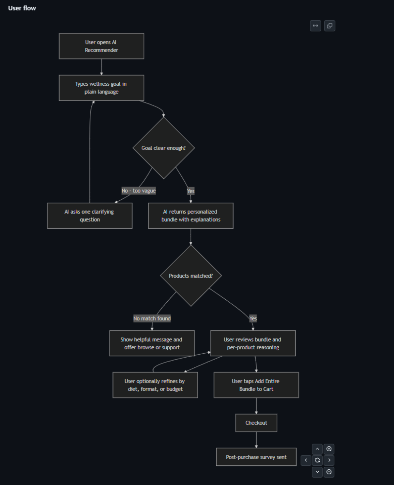
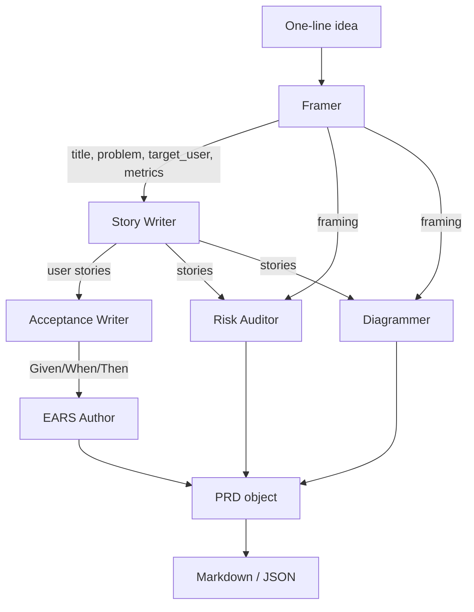

# prd-generator

> Turn a one-line product idea into a structured PRD — title, problem, target user, success metrics, user stories, Given/When/Then acceptance criteria, EARS requirements, risks, and rendered Mermaid diagrams — in one CLI call.

```bash
prd "Build a conversational AI shopping assistant for our health and wellness store..."
```

A fully-rendered PRD comes back in 30-50 seconds, with diagrams that GitHub renders natively when you commit the result to a repo.

<p align="center">
  
  <br>
  <em>The user-flow Mermaid diagram from <a href="examples/ai_shopping_assistant.md">examples/ai_shopping_assistant.md</a>, rendered by GitHub. Generated automatically by the Diagrammer agent — no hand-drawing.</em>
</p>

This repo is one of two reference implementations of the **Specs** rung of [The PM Scaffold](https://github.com/nich9000/pm-scaffold) — alongside [`ears-spec-agent`](https://github.com/nich9000/ears-spec-agent). See the [framework repo](https://github.com/nich9000/pm-scaffold) for the four-rung thesis and roadmap.

## What you get, concretely

Every generated PRD ships with these structural elements. Excerpts below are pulled verbatim from the example PRDs in `examples/`.

### An at-a-glance summary table at the top

| | |
|---|---|
| **Primary metric** | Increase add-to-cart rate from the recommendation flow by at least 20% compared to the existing quiz and filter baseline. |
| **Top risk** | HIGH — AI model produces supplement recommendations that contain clinically unsafe combinations or makes implied health claims that violate FDA/FTC regulations. |
| **Scope** | 8 stories (3 P0) · 16 requirements |
| **Persona** | Health-conscious adults aged 25-55 who can articulate a wellness goal but lack the expertise to map it to specific products. |

### Clean role/goal/benefit user stories with priorities

> **US-01 (P0).** As a **health-conscious adult new to supplements**, I want to type my wellness goal in plain language and immediately receive a personalized supplement bundle so that I can discover the right products quickly without needing prior supplement knowledge.

### EARS-template requirements that engineers can lint

> **R-04** If the AI recommendation engine is unavailable or returns an error during result generation, then the AI recommender shall display an error message within 10 seconds and not display any partial or empty recommendation bundle.

### Severity-coded risk callouts (GitHub renders these with colored borders)

> [!CAUTION]
> **HIGH** — Users input sensitive health information (e.g., "I have anxiety," "I'm managing diabetes") into the free-text goal field, creating unintended PHI/HIPAA-adjacent obligations.
>
> *Mitigation:* Implement a PII/PHI detection filter that hashes condition-specific terms before storage; do not use raw goal text for model retraining without anonymization.

### Two Mermaid diagrams — user flow + system context

The image at the top of this README is a real Diagrammer-agent output from one PRD run.

## Why this exists

Generic "write me a PRD" prompts produce mush — vague metrics, no error paths, requirements that read like marketing copy. `prd-generator` runs **six focused agents in sequence**, each owning one section of the document with explicit rules about what's testable, what's measurable, and what counts as a real risk vs. a platitude.

The natural extension of [`ears-spec-agent`](https://github.com/nich9000/ears-spec-agent), which transforms tickets *into* EARS specs. `prd-generator` zooms out: it owns the PRD around those specs.

## Architecture



Each agent has its own system prompt in `src/prd_generator/prompts/system.py` — diff and tweak independently. The Diagrammer is gated behind `--no-diagrams` for cost-conscious runs.

## Installation

Requires Python 3.10+.

```bash
git clone https://github.com/nich9000/prd-generator
cd prd-generator
python -m venv .venv && source .venv/bin/activate     # Windows: .venv\Scripts\activate
pip install -e ".[dev]"
cp .env.example .env                                  # then add your ANTHROPIC_API_KEY
```

## Usage

**CLI**

```bash
# Print to stdout
prd "Sellers should see at-a-glance which listings are losing rank week over week"

# Write to a file
prd -o specs/seller-rank-watch.md "Sellers should see..."

# Skip diagrams (saves ~$0.02/run)
prd --no-diagrams "..."

# Raw JSON for piping into other tools
prd --json "..." > prd.json
```

**Python**

```python
from prd_generator import generate_prd

prd = generate_prd("Customers should be able to refund a digital download")
print(prd.to_markdown())
print(prd.success_metrics)         # ['...', '...']
print(len(prd.ears_specs))         # int
```

## Example PRDs

Two reference outputs live in `examples/`. Both were generated by a single CLI call, end to end. No hand-editing of structure or content.

| File | Domain | What it showcases |
|---|---|---|
| [`examples/ios_webview_wrapper.md`](examples/ios_webview_wrapper.md) | iOS native shell over a mobile-web store | Apple Pay merchant configuration risk, App Store Guideline 4.2 (Minimum Functionality), WKWebView pre-warming, biometric Keychain access flags |
| [`examples/ai_shopping_assistant.md`](examples/ai_shopping_assistant.md) | Conversational AI shopping assistant for a wellness store | FDA/FTC structure-function claim risk, PHI/HIPAA exposure in free-text input, recommendation bias from merchandising weighting, adversarial scraping with hard cost ceiling |

Both PRDs name specific failure modes most teams discover during legal review three weeks before launch — the kind of detail that distinguishes a PRD from a wireframe annotation.

## What every generated PRD includes

- **Framing** — title, restated problem, target user, 3-5 measurable success metrics (each with a number or directional comparison).
- **User stories** — 4-8 stories in role/goal/benefit form with P0/P1/P2 priority, including at least one error/edge path.
- **Acceptance criteria** — Given/When/Then per story, including a negative case.
- **EARS requirements** — translated from acceptance criteria into the five EARS templates (ubiquitous, event, state, unwanted, optional) so engineers get unambiguous "shall" statements.
- **Risks** — specific failure modes (technical + GTM), each with severity and mitigation. Rendered as GitHub `[!CAUTION]` / `[!WARNING]` / `[!NOTE]` blocks.
- **Diagrams** — user-flow + system-context Mermaid blocks rendered natively by GitHub.
- **Out of scope + Open questions** — kept separate from requirements so reviewers know what's still being decided.

## Testing

```bash
pytest                           # 12 schema/render tests, no API key needed
ruff check src tests             # lint
```

The pipeline itself isn't unit-tested against the live API by default (the CI bill would hurt). Add an integration test file in `tests/` if you want to exercise it end to end.

## Config

Set in `.env` or your shell:

| Variable | Default | Notes |
|---|---|---|
| `ANTHROPIC_API_KEY` | *required* | from console.anthropic.com |
| `PRD_MODEL` | `claude-sonnet-4-6` | any Anthropic chat model |
| `PRD_MAX_TOKENS` | `4096` | per-agent cap |

Cost per PRD with the default model: roughly **$0.05-$0.10** including diagrams. Switch `PRD_MODEL` to `claude-haiku-4-5-20251001` for ~5x cheaper runs at slightly reduced sharpness on framing/risks.

## Roadmap

- `--review` mode: a critic agent that reads the generated PRD and surfaces gaps.
- Pluggable templates (engineering-heavy, design-heavy, GTM-heavy).
- Optional vector-store grounding ("write the PRD in the voice of our existing PRDs").
- A "domain-compliance" 7th agent for regulated industries (health, finance, education).
- Tiny Next.js demo so recruiters without an API key can play with it.

## License

MIT.
