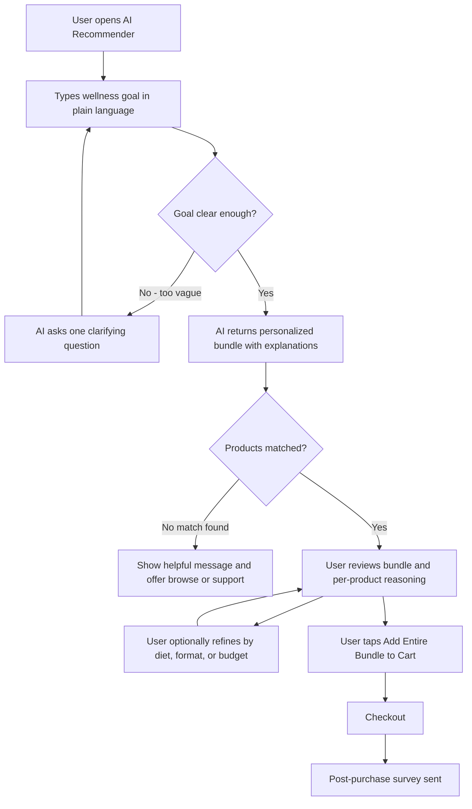
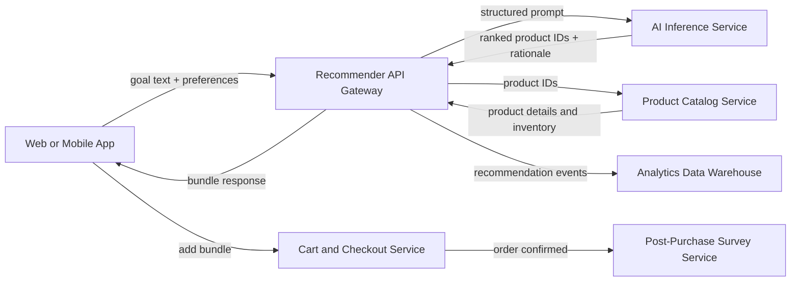

# AI Supplement Bundle Recommender

> Build a conversational AI shopping assistant for our health and wellness store that lets customers describe their wellness goals in natural language and recommends a personalized supplement and lifestyle bundle, replacing today's static category filters and quiz.

| | |
|---|---|
| **Primary metric** | Increase add-to-cart rate from the recommendation flow by at least 20% compared to the existing quiz and filter baseline, measured over a 90-day A/B test. |
| **Top risk** | HIGH — AI model produces supplement recommendations that contain clinically unsafe combinations (e.g., recommending high-dose melatonin alongside 5-HTP for a sleep goal) or makes implied health claims that violate FDA/FTC regulations on structure-function language, exposing the store to regulatory liability and consumer harm. |
| **Scope** | 8 stories (3 P0) · 16 requirements |
| **Persona** | Health-conscious adults aged 25-55 who are new to or casually familiar with supplements, shopping on the store's website or mobile app, who can articulate a wellness goal (e.g., 'I want more energy and better sleep') but lack the expertise to map that goal to specific products on their own. |

## Overview

### User flow

### System context

## Problem

Customers shopping for health supplements struggle to navigate static category filters and multi-step quizzes that require prior product knowledge, resulting in low conversion rates and high drop-off before purchase. Most shoppers know their wellness goals but cannot translate them into specific product categories, leaving them without a purchase and the store without a sale.

## Target user

Health-conscious adults aged 25-55 who are new to or casually familiar with supplements, shopping on the store's website or mobile app, who can articulate a wellness goal (e.g., 'I want more energy and better sleep') but lack the expertise to map that goal to specific products on their own.

## Success metrics

- Increase add-to-cart rate from the recommendation flow by at least 20% compared to the existing quiz and filter baseline, measured over a 90-day A/B test.
- Achieve a bundle attachment rate (customers purchasing 2 or more recommended items together) of 35% or higher within the first 6 months of launch.
- Reduce average time-to-first-product-add from session start to under 3 minutes, compared to a current baseline measured from the existing quiz flow.
- Reach a post-purchase survey satisfaction score of 4.2 out of 5 or higher for recommendation relevance among customers who used the assistant.
- Decrease 30-day return rate for supplement purchases originating from the assistant by at least 15% relative to purchases made through static filters.

## User stories

**US-01 (P0).** As a **health-conscious adult new to supplements**, I want to type my wellness goal in plain language (e.g., 'I want more energy and better sleep') and immediately receive a personalized supplement bundle recommendation without answering a long quiz so that I can discover the right products quickly without needing prior supplement knowledge, reducing the time it takes me to add items to my cart.

**US-02 (P0).** As a **health-conscious adult new to supplements**, I want to see a clearly explained bundle recommendation that includes why each product was chosen for my specific goal so that I feel confident the recommendations are relevant to me and am more likely to purchase multiple items together, rather than abandoning the page out of uncertainty.

**US-03 (P0).** As a **health-conscious adult new to supplements**, I want to add the entire recommended bundle to my cart in a single action from the recommendation results screen so that I can complete my purchase faster, reducing friction and increasing the likelihood I buy more than one product.

**US-04 (P1).** As a **health-conscious adult casually familiar with supplements**, I want to refine my recommendation results by indicating preferences such as dietary restrictions, format (capsule vs. gummy), or budget without restarting the entire flow so that I receive a bundle that fits my lifestyle constraints, making me more satisfied with the purchase and less likely to return the products.

**US-05 (P1).** As a **health-conscious adult using the assistant on mobile**, I want to access the AI recommender and receive results within a seamless mobile experience that does not require switching to a desktop browser so that I can complete my supplement discovery and purchase on whichever device I prefer, without losing my recommendation context.

**US-06 (P1).** As a **health-conscious adult who entered an ambiguous or very broad wellness goal**, I want to receive a clarifying prompt asking one focused follow-up question when my input is too vague for the AI to generate a confident recommendation so that I am guided toward a useful result rather than shown generic products or a blank error state, keeping me engaged in the flow instead of dropping off.

**US-07 (P2).** As a **health-conscious adult who completed a purchase through the assistant**, I want to receive a brief post-purchase survey asking me to rate how relevant my recommendations were so that my feedback is captured so the store can continuously improve recommendation quality and I feel heard as a customer.

**US-08 (P1).** As a **health-conscious adult whose wellness goal returns no matching products**, I want to see a clear, helpful message explaining that no bundle could be matched and be offered alternative next steps such as browsing top-rated products or contacting support so that I am not left on a dead-end screen and still have a path to finding what I need, preserving my trust in the store and reducing abandonment.

## Acceptance criteria

**AC-01**

- **Given** a health-conscious adult new to supplements is on the AI recommender entry screen
- **When** the user types a plain-language wellness goal (e.g., 'I want more energy and better sleep') and submits it
- **Then** a personalized supplement bundle recommendation of 1–5 products is displayed within 10 seconds, with no quiz or additional required steps before results appear

**AC-02**

- **Given** a user submits a wellness goal input that is empty or contains only whitespace
- **When** the user attempts to submit the form
- **Then** the system displays an inline validation error message ('Please describe your wellness goal') and does not call the recommendation API

**AC-03**

- **Given** a personalized supplement bundle recommendation has been generated for the user
- **When** the results screen is rendered
- **Then** each product in the bundle displays a human-readable rationale of at least one sentence explicitly connecting that product to the user's stated wellness goal, with no product shown without an explanation

**AC-04**

- **Given** the AI recommendation engine is unavailable or returns an error during result generation
- **When** the user submits a wellness goal
- **Then** an error message is shown within 10 seconds informing the user the service is temporarily unavailable, and no partial or empty recommendation bundle is displayed

**AC-05**

- **Given** a recommended bundle is displayed on the results screen and all products in the bundle are in stock
- **When** the user clicks the 'Add All to Cart' button
- **Then** all products in the bundle are added to the cart in a single action, the cart item count updates to reflect all added products, and a confirmation message is displayed within 3 seconds—without requiring the user to navigate to individual product pages

**AC-06**

- **Given** at least one product in a recommended bundle is out of stock
- **When** the user clicks the 'Add All to Cart' button
- **Then** only in-stock products are added to the cart, and a message clearly identifies which product(s) could not be added due to being out of stock

**AC-07**

- **Given** a recommendation results screen is displayed for a user who is casually familiar with supplements
- **When** the user selects one or more refinement preferences (dietary restriction, format such as capsule or gummy, or a maximum budget) from the refinement panel
- **Then** the bundle results are updated to reflect the selected filters within 10 seconds without restarting the wellness goal input flow, and the user's original goal text remains visible on screen

**AC-08**

- **Given** a user applies a budget filter that no products in the current bundle satisfy
- **When** the filter is submitted
- **Then** the results panel displays a message indicating no products match the selected budget and prompts the user to adjust the filter, rather than showing an empty or broken layout

**AC-09**

- **Given** a health-conscious adult accesses the AI recommender on a mobile device with a viewport width of 375px or greater
- **When** the user completes the wellness goal input and views the recommendation results
- **Then** all UI elements—including the goal input, results cards, per-product rationale, and 'Add All to Cart' button—are fully visible and operable without horizontal scrolling, and the full flow is completable within the mobile browser without redirection to a desktop URL

**AC-10**

- **Given** a user is on a mobile device and has received a recommendation, then navigates away and returns via browser back navigation
- **When** the results screen reloads
- **Then** the previously generated recommendation and the user's original goal text are still displayed without requiring the user to re-enter their goal

**AC-11**

- **Given** a user submits a wellness goal that is ambiguous or too broad for the AI to generate a recommendation with a confidence score above the defined threshold
- **When** the recommendation engine processes the input
- **Then** exactly one focused follow-up question is displayed to the user instead of product results or an error state, and the original goal text remains editable on the same screen

**AC-12**

- **Given** a clarifying follow-up question has been presented to the user
- **When** the user answers the follow-up question and resubmits
- **Then** a refined bundle recommendation is displayed within 10 seconds, and no additional clarifying questions are asked in the same session for that goal

**AC-13**

- **Given** a user has completed a purchase that included at least one product added via the AI recommender bundle
- **When** the order confirmation page loads
- **Then** a post-purchase survey containing a recommendation relevance rating scale (minimum 1–5 stars) is displayed on the confirmation page, and the user's survey response is recorded in the analytics system upon submission

**AC-14**

- **Given** a user who completed a purchase dismisses or ignores the post-purchase survey
- **When** the user closes the survey or navigates away from the confirmation page without responding
- **Then** no survey response is recorded for that session and the user is not shown the survey again for the same order

**AC-15**

- **Given** a user submits a wellness goal for which no products in the catalog match the recommendation criteria
- **When** the recommendation engine returns zero results
- **Then** the results screen displays a clear message explaining no bundle could be matched (not a blank page or generic error), and presents at least two alternative next steps—such as a link to browse top-rated products and a link to contact support—within the same screen

**AC-16**

- **Given** no matching products are found for a user's wellness goal
- **When** the user clicks the 'Browse Top-Rated Products' alternative next step
- **Then** the user is navigated to a pre-filtered product listing page showing top-rated products, and the navigation occurs without clearing any active session or cart data

## Requirements (EARS)

- **R-01** When a user types a plain-language wellness goal and submits it on the AI recommender entry screen, the AI recommender shall display a personalized supplement bundle recommendation of 1 to 5 products within 10 seconds, with no quiz or additional required steps before results appear.
- **R-02** If the user attempts to submit the wellness goal form with an empty input or input containing only whitespace, then the AI recommender shall display an inline validation error message reading 'Please describe your wellness goal' and not invoke the recommendation API.
- **R-03** When the recommendation results screen is rendered, the AI recommender shall display for each product in the bundle a human-readable rationale of at least one sentence explicitly connecting that product to the user's stated wellness goal, with no product displayed without an explanation.
- **R-04** If the AI recommendation engine is unavailable or returns an error during result generation, then the AI recommender shall display an error message within 10 seconds informing the user the service is temporarily unavailable and not display any partial or empty recommendation bundle.
- **R-05** When the user clicks the 'Add All to Cart' button while all products in the recommended bundle are in stock, the AI recommender shall add all products in the bundle to the cart in a single action, update the cart item count to reflect all added products, and display a confirmation message within 3 seconds without requiring navigation to individual product pages.
- **R-06** When the user clicks the 'Add All to Cart' button when at least one product in the recommended bundle is out of stock, the AI recommender shall add only in-stock products to the cart and display a message that clearly identifies each product that could not be added due to being out of stock.
- **R-07** When the user selects one or more refinement preferences from the refinement panel while a recommendation results screen is displayed, the AI recommender shall update the bundle results to reflect the selected filters within 10 seconds without restarting the wellness goal input flow, and keep the user's original goal text visible on screen.
- **R-08** If the user applies a budget filter that no products in the current bundle satisfy, then the AI recommender shall display a message in the results panel indicating no products match the selected budget and prompt the user to adjust the filter, without rendering an empty or broken layout.
- **R-09** When a user on a mobile device with a viewport width of 375px or greater completes the wellness goal input and views the recommendation results, the AI recommender shall render all UI elements—including the goal input, results cards, per-product rationale, and 'Add All to Cart' button—fully visible and operable without horizontal scrolling, and allow the complete flow to be finished within the mobile browser without redirection to a desktop URL.
- **R-10** When a user on a mobile device returns to the results screen via browser back navigation after previously receiving a recommendation, the AI recommender shall display the previously generated recommendation and the user's original goal text without requiring the user to re-enter their goal.
- **R-11** When the recommendation engine processes a wellness goal that is ambiguous or too broad and produces a confidence score at or below the defined threshold, the AI recommender shall display exactly one focused follow-up question to the user instead of product results or an error state, while keeping the original goal text editable on the same screen.
- **R-12** When the user answers the clarifying follow-up question and resubmits, the AI recommender shall display a refined bundle recommendation within 10 seconds and ask no additional clarifying questions in the same session for that goal.
- **R-13** When the order confirmation page loads for a purchase that included at least one product added via the AI recommender bundle, the AI recommender shall display a post-purchase survey containing a recommendation relevance rating scale of at minimum 1 to 5 stars on the confirmation page, and record the user's survey response in the analytics system upon submission.
- **R-14** When the user closes the post-purchase survey or navigates away from the confirmation page without responding, the AI recommender shall record no survey response for that session and not display the survey again to the user for the same order.
- **R-15** When the recommendation engine returns zero results for a user's submitted wellness goal, the AI recommender shall display a clear message on the results screen explaining that no bundle could be matched—not a blank page or generic error—and present at least two alternative next steps, including a link to browse top-rated products and a link to contact support, within the same screen.
- **R-16** When the user clicks the 'Browse Top-Rated Products' alternative next step after no matching products are found, the AI recommender shall navigate the user to a pre-filtered product listing page showing top-rated products without clearing any active session or cart data.

## Risks

> [!CAUTION]
> **HIGH** — AI model produces supplement recommendations that contain clinically unsafe combinations (e.g., recommending high-dose melatonin alongside 5-HTP for a sleep goal) or makes implied health claims that violate FDA/FTC regulations on structure-function language, exposing the store to regulatory liability and consumer harm.
>
> *Mitigation:* Implement a hard-coded safety layer and deny-list of prohibited ingredient interaction pairs reviewed by a licensed pharmacist or registered dietitian before launch. Pass all AI-generated explanatory copy through a compliance review pipeline that strips or flags disease-claim language. Add a persistent legal disclaimer on the recommendation screen. Establish a quarterly audit process with a regulatory consultant as SKU catalog evolves.

> [!CAUTION]
> **HIGH** — LLM inference latency exceeds 3–5 seconds on mobile networks under concurrent load, directly breaking the stated success metric of time-to-first-product-add under 3 minutes and degrading the core P0 user experience that differentiates this feature from the existing quiz.
>
> *Mitigation:* Establish a p95 latency SLA of ≤3 seconds in the technical design spec. Use streaming token rendering so partial results appear immediately. Load-test at 10× expected peak traffic before launch. Architect a fallback path that returns a pre-cached 'top bundles for your goal category' result if inference exceeds a 4-second timeout, rather than showing a spinner or error.

> [!CAUTION]
> **HIGH** — Users input sensitive health information (e.g., 'I have anxiety and can't sleep,' 'I'm managing diabetes') into the free-text goal field, creating unintended collection of health-condition data that may constitute PHI or trigger CCPA/HIPAA-adjacent obligations the store is not prepared to fulfill.
>
> *Mitigation:* Add a privacy notice on the input screen explicitly stating that free-text input is not stored linked to identity beyond the session. Implement a PII/PHI detection filter that blocks storage or logging of inputs containing condition-specific medical terms, replacing them with a hashed category label. Engage legal counsel to assess data retention obligations before launch and document the decision. Do not use raw goal text for model retraining without anonymization.

> [!WARNING]
> **MEDIUM** — The recommendation engine over-indexes on high-margin or overstocked SKUs through training data or catalog weighting, causing measurable recommendation bias that degrades satisfaction scores and increases 30-day returns when customers receive products misaligned with their stated goals.
>
> *Mitigation:* Separate merchandising business rules (promotions, inventory weighting) from the relevance-ranking model with explicit documentation of any intentional overrides. Include recommendation relevance score (post-purchase survey ≥4.2/5) and return rate as primary model evaluation metrics alongside conversion. Run a monthly bias audit comparing recommendation distribution against goal-category intent labels.

> [!WARNING]
> **MEDIUM** — Competitors or price-comparison tools scrape the AI recommendation flow at scale by submitting programmatic goal queries, extracting the store's product-bundling logic and pricing strategy, or inflating API costs to unsustainable levels.
>
> *Mitigation:* Rate-limit the recommendation endpoint by session token and device fingerprint. Require a soft authentication gate (email or guest token) before surfacing full bundle details and pricing. Monitor for anomalous query patterns (high velocity, non-human input phrasing) with automated alerting. Cap monthly LLM API spend with a hard ceiling and alert threshold.

> [!WARNING]
> **MEDIUM** — Go-to-market risk: The 35% bundle attachment rate target is set without a validated baseline for what the current quiz flow achieves for multi-item purchases, meaning the target may be either trivially easy or structurally impossible given the existing customer purchase behavior, causing the feature to be declared a failure or success for the wrong reasons during the 6-month window.
>
> *Mitigation:* Before launch, instrument the existing quiz and filter flow to capture a clean 30-day multi-item attachment baseline. Socialize the baseline with stakeholders to confirm or recalibrate the 35% target. Define in advance whether attachment is measured at cart-add or confirmed purchase to prevent metric interpretation disputes post-launch.

## Out of scope

- Personalized dosage or timing instructions for recommended supplements
- Integration with electronic health records or physician recommendation data
- Subscription or auto-replenishment logic triggered by the recommendation flow
- Inventory reservation or real-time stock gating at the recommendation layer
- Loyalty or rewards point calculation for bundle purchases
- Multi-language or international regulatory compliance beyond the primary market

## Open questions

- What is the current measured multi-item attachment rate from the existing quiz flow, and has it been instrumented for a clean pre-launch baseline?
- Has legal counsel confirmed the regulatory boundary between permissible structure-function claims and prohibited disease claims for the AI-generated explanation copy?
- Who owns the catalog taxonomy that maps SKUs to wellness goal categories, and what is the process for keeping it current as new products are added?
- Will the recommendation flow be accessible to guest users, or will it require account creation or email capture, and how does this decision affect the A/B test attribution methodology?
- What is the approved LLM vendor and data processing agreement, and does it permit customer input data to be used for model improvement by the vendor?
- Is the post-purchase survey (P2 story) a prerequisite for the recommendation quality feedback loop before launch, or is it acceptable to launch without it and retrofit?
