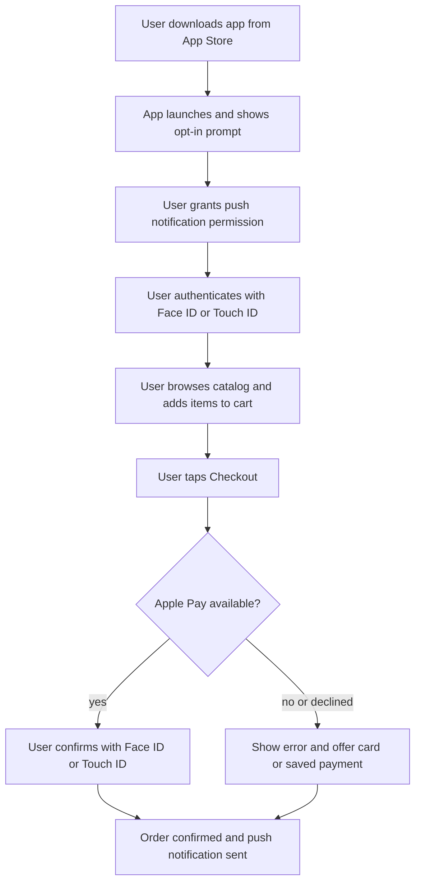
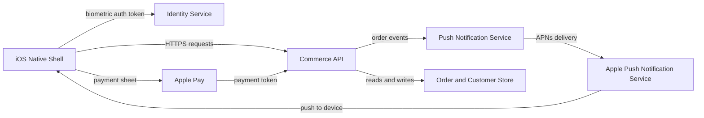

# Native iOS Shell for Mobile Web Store

> Ship our existing mobile-web shopping experience as a native iOS app using a WebView wrapper, so customers can install us from the App Store and we can use push notifications, biometric unlock, and Apple Pay without rebuilding the storefront.

| | |
|---|---|
| **Primary metric** | Achieve a checkout conversion rate in the iOS app that is at least 15% higher than the current mobile-web checkout conversion rate within 90 days of launch. |
| **Top risk** | HIGH — Apple Pay entitlement and merchant ID configuration errors delay launch. Misconfigured merchant certificates, missing Associated Domains entitlements, or sandbox/production environment mismatches can cause Apple Pay to silently fail or be unavailable on device—blocking the P0 checkout story and the 30% checkout-time reduction metric. |
| **Scope** | 8 stories (5 P0) · 15 requirements |
| **Persona** | Existing and prospective customers who shop on iOS devices and prefer or expect a native app experience, particularly repeat buyers who would benefit from faster authentication and checkout. |

## Overview

### User flow

### System context

## Problem

Customers shopping on our mobile website cannot install the store on their home screen via the App Store, receive push notifications about orders or promotions, authenticate quickly with Face ID/Touch ID, or check out using Apple Pay — all of which require a native iOS container that we currently lack.

## Target user

Existing and prospective customers who shop on iOS devices and prefer or expect a native app experience, particularly repeat buyers who would benefit from faster authentication and checkout.

## Success metrics

- Achieve a checkout conversion rate in the iOS app that is at least 15% higher than the current mobile-web checkout conversion rate within 90 days of launch.
- Reach a push notification opt-in rate of 50% or more among new app installs within the first 60 days.
- Reduce average checkout time (cart to order confirmation) by 30% for sessions where Apple Pay is used compared to the mobile-web credit-card flow baseline.
- Attain an App Store rating of 4.2 stars or higher within the first 500 ratings.
- Drive at least 20% of total mobile order volume through the iOS app within 6 months of launch.

## User stories

**US-01 (P0).** As a **iOS shopper**, I want to download the store app from the App Store and install it on my home screen so that I have a native app icon for quick, one-tap access to the store without navigating to a browser.

**US-02 (P0).** As a **repeat iOS shopper**, I want to authenticate into my existing account using Face ID or Touch ID instead of typing my email and password so that I can log in in seconds, reducing friction that previously caused me to abandon the session.

**US-03 (P0).** As a **iOS shopper with items in my cart**, I want to complete payment using Apple Pay with a single Face ID or Touch ID confirmation so that I can check out significantly faster without manually entering card and billing details, increasing my likelihood of completing the purchase.

**US-04 (P0).** As a **new app installer**, I want to be presented with a clear, plain-language push notification opt-in prompt that explains what notifications I will receive before iOS shows the system dialog so that I can make an informed choice, increasing my trust in the app and the likelihood I will opt in to order and promotional alerts.

**US-05 (P1).** As a **opted-in iOS shopper**, I want to receive a push notification when my order status changes (e.g., confirmed, shipped, out for delivery) so that I stay informed about my order without having to open the app or check my email, reinforcing my confidence in the shopping experience.

**US-06 (P1).** As a **opted-in iOS shopper**, I want to receive targeted promotional push notifications (e.g., flash sales, back-in-stock alerts) that deep-link directly to the relevant product or category page so that I can act on relevant offers immediately, driving incremental purchases that contribute to app order volume.

**US-07 (P0).** As a **iOS shopper whose Apple Pay transaction is declined or unavailable**, I want to be shown a clear error message and seamlessly offered an alternative payment method (credit/debit card or saved payment) without losing my cart so that I can still complete my purchase without frustration or having to restart checkout, protecting conversion even in the error case.

**US-08 (P2).** As a **first-time app user who is not yet logged in**, I want to browse the store and add items to a guest cart before being prompted to sign in or register only at checkout so that I can explore the catalog without commitment, lowering the barrier to first engagement and improving the likelihood I complete a first purchase.

## Acceptance criteria

**AC-01**

- **Given** A user searches for the store app by name in the iOS App Store on a supported iOS version (iOS 16+)
- **When** the user taps 'Get' and confirms installation
- **Then** the app icon appears on the home screen within 60 seconds and the app launches successfully on first tap

**AC-02**

- **Given** A user attempts to install the app on a device running an iOS version below the minimum supported version
- **When** the user views the App Store listing
- **Then** the app is not installable and the App Store displays a message indicating the device or OS is not compatible

**AC-03**

- **Given** A returning user with an existing account has Face ID or Touch ID enabled on their device and has previously linked biometric authentication to their account in the app
- **When** the user opens the app and taps 'Sign in with Face ID / Touch ID'
- **Then** the user is authenticated and lands on their account home screen within 3 seconds of successful biometric confirmation

**AC-04**

- **Given** A returning user attempts biometric login but fails authentication (e.g., unrecognized face or finger) three consecutive times
- **When** the third biometric attempt fails
- **Then** biometric login is disabled for that session, the user is prompted to enter their email and password, and no account lockout is triggered solely by biometric failure

**AC-05**

- **Given** An authenticated iOS shopper has one or more items in their cart and the device has Apple Pay configured with at least one valid payment method
- **When** the user taps 'Apple Pay' at checkout and confirms with Face ID or Touch ID
- **Then** the order is placed, a confirmation screen with order number is displayed within 5 seconds, and the cart is cleared

**AC-06**

- **Given** An authenticated iOS shopper has items in their cart and taps 'Apple Pay' but Apple Pay is not set up on the device
- **When** the Apple Pay sheet fails to load
- **Then** an inline error message is displayed explaining Apple Pay is unavailable, the cart contents are preserved, and the user is offered alternative payment methods (credit/debit card or saved payment) without restarting checkout

**AC-07**

- **Given** A first-time user has installed the app and launches it for the first time
- **When** the app reaches the notification opt-in step during onboarding
- **Then** a custom in-app screen is displayed before the iOS system prompt, describing in plain language the specific notification types (e.g., order updates, promotional offers) the user will receive, and the iOS system dialog only appears after the user taps 'Continue' on the custom screen

**AC-08**

- **Given** A first-time user taps 'Decline' or 'Not Now' on the custom pre-prompt notification screen
- **When** the user dismisses the pre-prompt
- **Then** the iOS system dialog is not shown, the user proceeds into the app without interruption, and the app does not attempt to show the pre-prompt again in the same session

**AC-09**

- **Given** An iOS shopper has opted in to push notifications and has a confirmed order
- **When** the order status changes to 'Confirmed', 'Shipped', or 'Out for Delivery' in the backend system
- **Then** a push notification is delivered to the user's device within 5 minutes of the status change, displaying the relevant status text and order identifier

**AC-10**

- **Given** An iOS shopper has opted out of push notifications at the iOS system level
- **When** an order status change event is triggered in the backend
- **Then** no push notification is delivered to that device and no error is logged in the app; the status change remains visible inside the app when the user opens it

**AC-11**

- **Given** An opted-in iOS shopper is eligible for a targeted promotional notification (e.g., flash sale, back-in-stock alert)
- **When** the push notification is delivered and the user taps it
- **Then** the app opens directly to the relevant product page or category page (deep link) within 2 seconds, and the user does not land on the app home screen

**AC-12**

- **Given** A promotional push notification contains a deep link to a product that has since been removed from the catalog
- **When** the user taps the notification
- **Then** the app opens and displays a clear 'Product no longer available' message on the intended destination page rather than a blank screen or unhandled error

**AC-13**

- **Given** An iOS shopper with items in their cart initiates Apple Pay checkout and the payment transaction is declined by the payment processor
- **When** the decline response is returned
- **Then** a clear, human-readable error message (e.g., 'Your Apple Pay payment was declined. Please try another payment method.') is shown, the cart contents are fully preserved, and the user is presented with selectable alternative payment methods without re-entering cart or shipping information

**AC-14**

- **Given** A guest user (not logged in) is browsing the app on iOS
- **When** the user taps 'Add to Cart' on a product page
- **Then** the item is added to a guest cart and the cart item count updates in the UI without any sign-in or registration prompt being displayed

**AC-15**

- **Given** A guest user has one or more items in their guest cart and taps 'Proceed to Checkout'
- **When** the checkout flow begins
- **Then** the user is prompted to sign in or create an account at that step, the guest cart items are preserved and displayed in the checkout summary after authentication, and no items are lost during the sign-in/registration transition

## Requirements (EARS)

- **R-01** When a user taps 'Get' and confirms installation of the store app in the iOS App Store on a device running iOS 16 or later, the app shall appear as an icon on the home screen within 60 seconds and launch successfully on the first tap.
- **R-02** If a user views the App Store listing for the store app on a device running an iOS version below the minimum supported version, then the App Store shall prevent installation of the app and display a message indicating the device or OS is not compatible.
- **R-03** When a returning user with biometric authentication previously linked to their account taps 'Sign in with Face ID / Touch ID' and biometric confirmation succeeds, the app shall authenticate the user and display their account home screen within 3 seconds of successful biometric confirmation.
- **R-04** If a returning user fails biometric authentication three consecutive times, then the app shall disable biometric login for that session, prompt the user to enter their email and password, and not trigger an account lockout solely as a result of the biometric failures.
- **R-05** When an authenticated iOS shopper with one or more items in their cart and a configured Apple Pay payment method taps 'Apple Pay' at checkout and confirms with Face ID or Touch ID, the app shall place the order, display a confirmation screen containing the order number within 5 seconds, and clear the cart.
- **R-06** If an authenticated iOS shopper taps 'Apple Pay' at checkout and the Apple Pay sheet fails to load because Apple Pay is not set up on the device, then the app shall display an inline error message explaining that Apple Pay is unavailable, preserve all cart contents, and present alternative payment methods (credit/debit card or saved payment) without requiring the user to restart the checkout flow.
- **R-07** When a first-time user reaches the notification opt-in step during onboarding, the app shall display a custom in-app screen before the iOS system prompt that describes in plain language the specific notification types the user will receive, and show the iOS system dialog only after the user taps 'Continue' on the custom screen.
- **R-08** When a first-time user taps 'Decline' or 'Not Now' on the custom pre-prompt notification screen, the app shall suppress the iOS system notification dialog, allow the user to proceed into the app without interruption, and not display the custom pre-prompt screen again during the same session.
- **R-09** When an order status changes to 'Confirmed', 'Shipped', or 'Out for Delivery' in the backend system for an iOS shopper who has opted in to push notifications, the app shall deliver a push notification to the user's device within 5 minutes of the status change, displaying the relevant status text and order identifier.
- **R-10** When an order status change event is triggered in the backend for an iOS shopper who has opted out of push notifications at the iOS system level, the app shall not deliver a push notification to the device, not log an error in the app, and display the updated order status within the app when the user next opens it.
- **R-11** When an opted-in iOS shopper taps a delivered promotional push notification containing a valid deep link, the app shall open directly to the relevant product page or category page within 2 seconds without routing the user through the app home screen.
- **R-12** If a user taps a promotional push notification whose deep link targets a product that has been removed from the catalog, then the app shall open and display a clear 'Product no longer available' message on the intended destination page instead of a blank screen or unhandled error.
- **R-13** If the payment processor returns a decline response during an Apple Pay checkout initiated by an authenticated iOS shopper, then the app shall display a clear, human-readable error message (e.g., 'Your Apple Pay payment was declined. Please try another payment method.'), fully preserve the cart contents, and present selectable alternative payment methods without requiring the user to re-enter cart or shipping information.
- **R-14** When a guest user taps 'Add to Cart' on a product page, the app shall add the item to a guest cart and update the cart item count in the UI without displaying a sign-in or registration prompt.
- **R-15** When a guest user with one or more items in their guest cart taps 'Proceed to Checkout', the app shall prompt the user to sign in or create an account, preserve all guest cart items, display those items in the checkout summary after authentication is complete, and ensure no items are lost during the sign-in or registration transition.

## Risks

> [!CAUTION]
> **HIGH** — Apple Pay entitlement and merchant ID configuration errors delay launch. Misconfigured merchant certificates, missing Associated Domains entitlements, or sandbox/production environment mismatches can cause Apple Pay to silently fail or be unavailable on device—blocking the P0 checkout story and the 30% checkout-time reduction metric.
>
> *Mitigation:* Allocate a dedicated spike (2–3 days) early in the sprint to provision merchant IDs, generate payment processing certificates, and validate end-to-end Apple Pay flows on physical devices in both sandbox and production environments. Define a go/no-go gate: Apple Pay must pass on at least two physical device models before the build is submitted to App Store review.

> [!CAUTION]
> **HIGH** — WKWebView or web-to-native bridge instability causes cart state loss during the Apple Pay fallback flow. If the native shell hands off to a web payment fallback after a declined Apple Pay transaction, session cookies or cart tokens may not persist across the context switch, resulting in lost carts—directly contradicting the P0 fallback story.
>
> *Mitigation:* Implement explicit cart-state serialization before initiating any payment flow; restore state from local storage or a server-side cart ID on every payment context switch. Write automated UI tests covering the decline-and-fallback scenario and include it in the regression suite before launch.

> [!CAUTION]
> **HIGH** — Face ID / Touch ID Keychain credential storage is not encrypted at the correct accessibility level, leaving stored tokens accessible when the device is unlocked by any means (not just biometrics). This is a security regression vs. the existing web login and could trigger an App Store rejection or a post-launch security disclosure.
>
> *Mitigation:* Store authentication tokens using kSecAttrAccessibleWhenPasscodeSetThisDeviceOnly with kSecAccessControlBiometryCurrentSet. Conduct a Keychain security review with a mobile security engineer before TestFlight beta. Include this as a documented acceptance criterion on the biometric login story.

> [!WARNING]
> **MEDIUM** — Push notification opt-in rate falls well below the 50% target because the pre-permission soft-prompt is shown immediately at first launch before users have experienced any app value. Users who decline the soft prompt will also decline the iOS system dialog, and that decision is permanent until they manually revisit Settings.
>
> *Mitigation:* Delay the opt-in prompt until a clear value moment (e.g., immediately after first order confirmation or after the user views order history). A/B test prompt timing and copy in the first 30 days post-launch. Track soft-prompt acceptance rate and iOS system dialog acceptance rate separately so the funnel failure point is observable.

> [!WARNING]
> **MEDIUM** — App Store review rejection due to insufficient native functionality. Apple has historically rejected apps that are thin wrappers around a web view with no meaningful native features beyond the web content. A primarily WKWebView-based shell with only Apple Pay and biometrics bolted on could be flagged under App Store Review Guideline 4.2 (Minimum Functionality).
>
> *Mitigation:* Audit the submission against Guideline 4.2 before first submission. Ensure the native layer provides demonstrable value: biometric auth, Apple Pay, push notifications, and deep-link routing should all be explicitly functional and reviewable in the demo account provided to Apple. Prepare a reviewer note that itemizes each native capability. Budget one iteration cycle (1–2 weeks) for a potential rejection and resubmission.

> [!WARNING]
> **MEDIUM** — The 20%-of-mobile-order-volume target is undermined by insufficient App Store discoverability and lack of a migration nudge for existing mobile-web users. Without ASO investment and an in-browser prompt directing existing customers to the app, organic installs alone are unlikely to shift a meaningful share of order volume within 6 months.
>
> *Mitigation:* Launch a Smart App Banner on the mobile web store on day one to convert existing web sessions to app installs. Invest in App Store Optimization (keyword research, screenshot creative, preview video) before launch. Define a paid UA budget and channel plan targeting existing email/SMS subscribers. Set a 60-day install milestone (e.g., 10,000 installs) as an early leading indicator before the 6-month order-volume target is evaluated.

## Out of scope

- Android app or Google Play Store distribution
- iPad-optimized layout or split-view support
- In-app purchase flows using Apple's StoreKit (physical goods sold via Apple Pay are out of App Store in-app purchase scope, but this distinction must be documented)
- Offline browsing or service-worker-style caching within the native shell
- Apple Watch or App Clip variants
- Customer support chat or live agent features within the app
- Loyalty points, referral programs, or gamification mechanics
- Backend commerce platform changes required solely for web parity (scope is the iOS container, not re-platforming the store)

## Open questions

- Is the shell architecture primarily WKWebView rendering the existing mobile web store, a fully native UI, or a hybrid? The answer materially affects the App Store rejection risk and the effort to hit the App Store rating target.
- Which push notification service will be used (APNs direct, Firebase Cloud Messaging, or a third-party CDP like Braze or Klaviyo), and is the backend notification infrastructure already built or does it need to be scoped?
- How will cart and session state be shared between the mobile web store and the iOS app for users who switch channels mid-session? Is there a server-side cart ID that can be referenced across both surfaces?
- What is the Apple Pay merchant category code and are there any regulatory or payment processor constraints (e.g., high-risk goods categories) that could complicate merchant ID approval?
- Is there an existing account system with OAuth/JWT tokens that biometric login can wrap, or does the authentication architecture need to be extended to support token-based silent re-authentication?
- What are the deep-link URL schema standards for promotional push notifications, and who owns the mapping between notification payload and in-app destination (marketing team, backend, or mobile engineering)?
